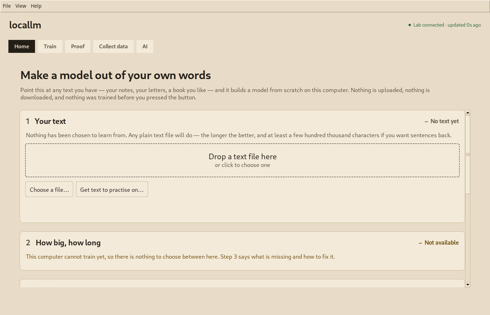
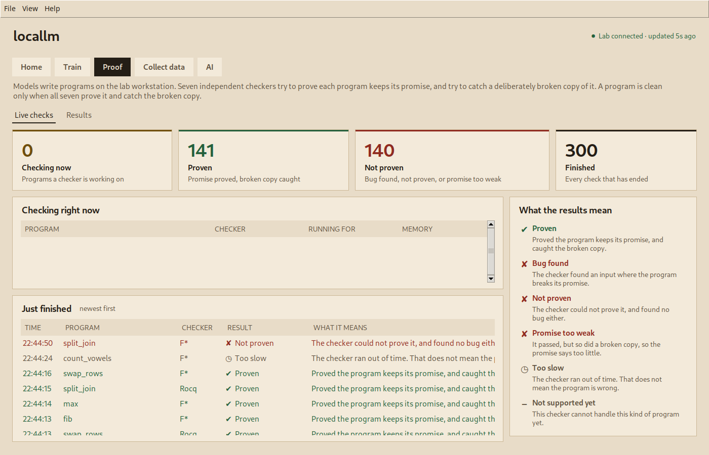
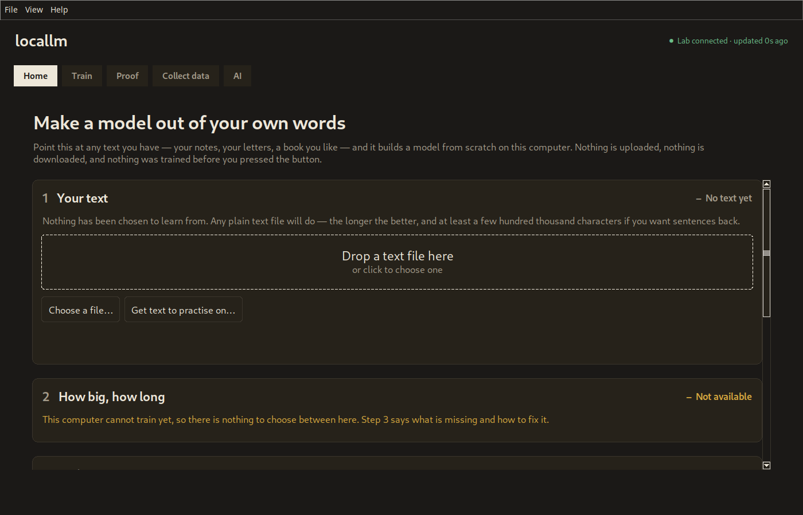

# locallm

**Point it at your own writing and it builds a language model from random
numbers, on your computer, with nothing uploaded. The same repository holds the
machine that made its training data: a specification language lowered into seven
independent proof systems, where an example is kept only if all seven prove it
and all seven catch a deliberately broken copy of it.**



The industry bet is scale: more parameters, more tokens, more scraped code. This
one bets the other way. Keep only what can be proved, then see how far a small
model gets on it.

## The result

**locallm has 92 million parameters. Phi-4-mini has 3.8 billion, 41 times more.
On 232 held-out programming problems, both produced exactly 3 answers that were
correct and formally proved.**

| | locallm | Phi-4-mini |
|---|---:|---:|
| parameters | **92M** | 3.8B |
| trained | from random numbers, on one shared GPU | by Microsoft, on a cluster |
| **clean answers of 232** | **3** | **3** |
| of those, confirmed to specify the right problem | **3** | 2 |

An answer counts as **clean** only when it passes the problem's own tests, is
verified against its specification by **seven independent proof systems** (Dafny,
Verus, SPARK, Frama-C, Lean 4, Rocq, F\*), and all seven catch a deliberately
sabotaged copy of it at a concrete input. That is a far harder bar than passing
unit tests. Phi was regraded the same day, by the same evaluator, beside locallm,
so the two numbers are comparable rather than quoted from different weeks.

**"locallm" is several models, not one**, and this page quotes two of them. The
92M above is the specialized core that draws level with Phi, round 8 with
signature-headed training. The smaller rounds trained from random weights are
separate checkpoints and are quoted separately below, so a size ratio here and a
size ratio there will not agree. Every round is listed with its own parameter
count, decoding and score in [`SCOREBOARD.md`](SCOREBOARD.md).

**It is a tie, not a win, and it is three answers wide.** 3 of 232 is 1.3%: both
models fail the overwhelming majority of the time. Phi has never seen t, so most
of its answers do not parse, which makes this a weaker claim than beating it at
Python. The full caveats are in [`LIMITS.md`](LIMITS.md), and they are not buried
there to be hidden: they are the reason this section is short.

## Running it

```
python3 locallm/app.py
```

That is the whole thing on Linux and macOS. It needs Python with Tk, which on
Debian and Ubuntu means `sudo apt install python3-tk`, because tkinter ships as a
separate package there. Training additionally needs PyTorch; the window opens,
explains itself, and can still write text without it.

**It does something before you install anything else**, and it is worth being
exact about which copy. `locallm/plain_generate.py` runs a trained model in the
standard library alone, no PyTorch and no numpy: measured, a 43.5 MB checkpoint
loads instantly and generates at 292 ms per character. Slow, and enough to see
what the thing does on a machine that has never installed a machine learning
library.

**The download carries a model. A clone does not.** The release zip built by
`locallm/release.py` includes one as `included-model/`, so unzipping and running
gives you something that talks back immediately. This repository stores its
checkpoints under `t/runs/` through Git LFS, so a plain `git clone` gets pointer
files rather than weights. To get them:

```
git lfs pull
python3 locallm/plain_generate.py --out t/runs/2026-09-17/home-4080/models/model-r4 --prompt "function to "
```

An earlier version of this section said a trained model ships with the
repository. It ships with the download. See [`CORRECTIONS.md`](CORRECTIONS.md).

## What it reads

Point it at a file or a folder. One reader decides, and it either decodes your
text properly and tells you which encoding worked, or it refuses and says why in
a sentence you can act on. It never returns half a file.

- **Whatever encoding it can identify.** A byte order mark decides outright, then
  strict UTF-8, then cp1252. This matters more than it sounds: a note saved from
  Windows Notepad as UTF-16 used to arrive as 4,960 characters of which 2,560
  were NUL, and the same note in Japanese kept one character of its eighteen.
  Both now read exactly.
- **Word documents, EPUB books and HTML**, read with the standard library alone,
  so the dependency list stays PyTorch and Tk.
- **PDF and RTF are refused by name**, with what to do instead. A PDF used to be
  accepted as prose and contributed 576 characters of printer instructions to the
  vocabulary.
- **Any script.** The tokenizer works on characters, so Arabic, Chinese and
  Devanagari need nothing special from it. What they need is a font that can draw
  them, and the window says so when one is missing rather than showing empty
  boxes.

## What locallm has done

Eight results, each linked to the script that produced it:
[`locallm/ACHIEVEMENTS.md`](locallm/ACHIEVEMENTS.md). The short version:

1. **It learned a formal language almost perfectly, from nothing.** Round 4,
   10.9M parameters trained from random weights, wrote a syntactically valid
   program for **209 of 232** unseen problems. Phi-4-mini, about 350 times
   larger, managed **12**. Everyone assumes notation is the hard part for a tiny
   model. It isn't. It's nearly free.
2. **It matches a model 41 times its size**, at 3 clean answers each. All three
   of locallm's survived a check that the specification describes the problem
   actually asked; one of Phi's three could not be checked.
3. **When it is right, it is provably right.** Every locallm answer that computed
   the right values cleared all seven provers with the sabotaged copy caught:
   **2 of 2** in rounds 4 and 5, **1 of 1** in round 7, and **3 of 3** in the
   round that ties Phi. Phi's comparable rate is 3 of 6.
4. **Stop it and restart it and you get the identical model**, bit for bit, with
   a test that fails the moment that stops being true.
5. **It is nowhere near the size this hardware can train.** Measured by training
   until it ran out of memory: **875 million parameters** fits on one shared
   card. Nobody had ever checked.
6. **It builds its own vocabulary** instead of borrowing one, cutting the same
   text into about **60% as many chunks**.
7. **It generates faster, and only because that was checked first.** The
   prediction failed, so the feature ships **off by default**.
8. **We tested our own architectural belief and it was wrong.** A "modern" design
   led by 25% early and lost at **every one of three seeds** when run four times
   longer.

**And none of it is a win yet.** The gap is problem-solving, not formality.

## Why this setup is unusual

- **Seven proof systems, not one.** Each gets its own translation of every
  program, and a training example survives only if **all seven** verify it.
  Projects that verify their training data usually use one prover.
- **Every program ships with a sabotaged twin.** [`t/twins/`](t/twins/) is 426
  pairs: 213 verified programs answering 90 problems, each paired with a
  near-miss, the concrete input where the two disagree, and seven independent
  refutations. That is what stops a prover waving through something it never
  really checked. We have not found another published set of that shape.
- **Predictions are written down before runs, including the wrong ones.** Several
  of this project's own beliefs died that way and the files that killed them are
  in the repo.
- **It corrects itself in public.** [`CORRECTIONS.md`](CORRECTIONS.md) is the
  record, and it is not decorative: it holds a case where this README described a
  safety rule that held only for a command-line script, while the window a person
  actually opens did not use it.
- **The design is researched, and then challenged.** Every colour, size and
  default in [`locallm/DESIGN-BRIEF.md`](locallm/DESIGN-BRIEF.md) carries a
  fetched source and an evidence grade. A second pass re-fetched every one of
  those sources hunting for claims the document could not support, and found
  eleven, including one in its own strongest citation.



## Start here

| I want to | Go to |
|---|---|
| run it | [`locallm/START-HERE.md`](locallm/START-HERE.md) |
| see every result with its settings and hashes | [`locallm/ACHIEVEMENTS.md`](locallm/ACHIEVEMENTS.md) |
| know what is *not* claimed | [`LIMITS.md`](LIMITS.md) |
| understand the model builder | [`locallm/README.md`](locallm/README.md) |
| understand the specification language and its seven kernels | [`t/README.md`](t/README.md) |
| see the full scoreboard against Phi and every baseline | [`SCOREBOARD.md`](SCOREBOARD.md) |
| see what was tried and ruled out | [`SCOREBOARD.md`](SCOREBOARD.md#what-has-been-ruled-out-and-what-it-cost-to-find-out) |
| read why the window looks the way it does | [`locallm/DESIGN-BRIEF.md`](locallm/DESIGN-BRIEF.md) |
| read the problem corpora | [`nl/README.md`](nl/README.md) |
| read the day-by-day record, failures included | [`internal/ROADMAP-LOG.md`](internal/ROADMAP-LOG.md) |
| know what comes next | [`ROADMAP.md`](ROADMAP.md) |

## The pipeline

```
problems in English, with tests (nl/; pool v6 is 4,035, 232 held out and never trained on)
  -> a generator model writes a specified program for each          spec_experiment.py generate
  -> keep only programs that pass their tests and copy nothing seen  spec_experiment.py tests, pool_pick.py
  -> prove each in Dafny, Verus, SPARK, Frama-C, Lean 4, Rocq, F*    run_par.py
     and require all seven to refute a deliberately broken twin
  -> check each accepted specification against the problem's own solution   spec_check.py
  -> the clean pool                                                  loop_dataset.py
  -> build a model from it: locallm from scratch, or a 1.5B student  loop_locallm.py, loop_train.py
  -> score every model on the 232 held-out problems                  score_heldout.py
```

An answer all seven prove but whose tests fail is counted separately as **proven
but wrong**. The held-out split has never changed, so every number in this
repository is comparable to every earlier one.

## What is in the repository

| Path | What it is |
|---|---|
| [`locallm/`](locallm/) | the model builder and the window: a transformer trained from random weights on your own hardware |
| [`t/`](t/) | the filter: a small specification language translated into seven proof systems, and every pipeline script |
| [`t/twins/`](t/twins/) | 426 pairs: a verified program, a near-miss, and the input that separates them |
| [`nl/`](nl/) | natural-language programming problems with tests, from four public sources |
| [`tup/`](tup/) | a Linux distribution built from source with a receipt per step |
| [`internal/`](internal/) | handoffs, the machine plan, the dated engineering log that is the roadmap of record |

## The window follows your system

Light by default, dark when your desktop is set dark, on all three platforms.
Which way round that should be was not a taste decision: two of the three
platform owners publish a default and both of them say light.



## License

Research use only: the whole repository may be used, copied, modified and
redistributed for research and education, and for nothing else without written
permission ([`LICENSE`](LICENSE)). Third-party material keeps its own licenses;
the problem corpora under `nl/` list theirs. `locallm/` was MIT until 2026-09-15.

Copyright (c) 2026 Treston Malachi Cuzzort.
